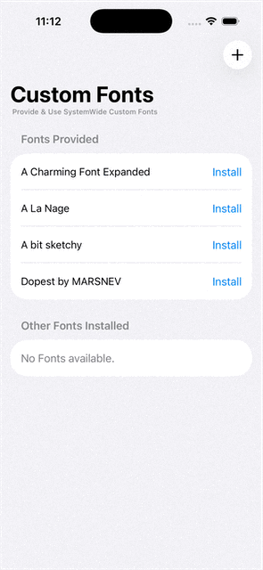

# SwiftUI: Custom Fonts Provider / Consumer

A demo of providing and using system wide custom fonts.

Specifically, 
- Register (Install) fonts systemwide
- Remove installed fonts
- Obtain registered fonts
- Request for fonts installed by other Apps
- Watch for systemwide font changes

For more details, please refer to my article: [SwiftUI: Provide/Use Systemwide Fonts]()

